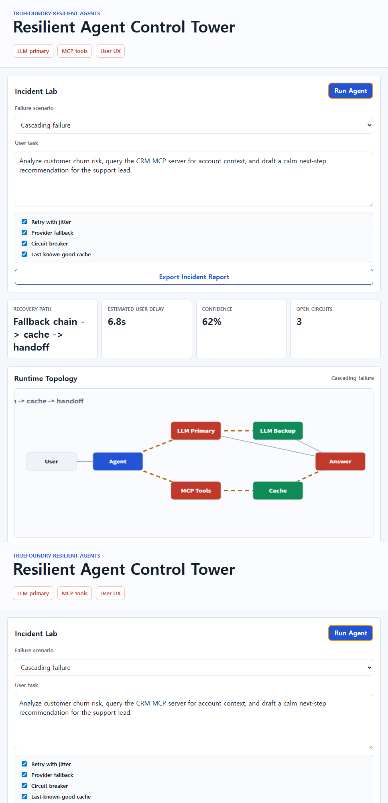

# Resilient Agent Control Tower

Submission candidate for the DevNetwork AI + ML Hackathon 2026 TrueFoundry Resilient Agents challenge.

## What It Does



Resilient Agent Control Tower is a browser-based demo that shows how an AI agent should behave when the infrastructure around it starts failing:

- LLM provider timeout or brownout
- MCP server outage
- malformed tool response
- rate limit pressure
- cascading multi-provider failure

Instead of hiding errors behind a spinner, the demo shows the recovery plan, circuit-breaker state, fallback route, degraded response, and user-facing explanation.

## Why It Matches The Challenge

The TrueFoundry track asks how an agent behaves when MCP or LLM infrastructure starts erroring out. This project focuses on the user side of that incident:

- Visible status for LLM and MCP dependencies
- Automatic retry, timeout, fallback, cache, and circuit-breaker policies
- Scenario simulator that produces explainable incident timelines
- A final answer panel that tells the user what happened and how reliable the answer is

## Run Locally

Live demo:

https://wognsdl2.github.io/resilient-agent-control-tower/

```bash
python -m http.server 8092
```

Then open:

```text
http://127.0.0.1:8092
```

## Test

```bash
node tests/router.test.mjs
```

The test checks that each incident scenario produces a useful recovery plan and never returns an empty user response.

## Demo Script

1. Start with the Healthy scenario and run the agent.
2. Switch to LLM Timeout and show fallback from primary model to backup model.
3. Switch to MCP Outage and show cached context plus degraded response.
4. Switch to Cascading Failure and show the incident timeline, open circuits, and handoff recommendation.
5. Export the report to show an audit trail that could be attached to support or incident review.

## Prize Track

DevNetwork AI + ML Hackathon 2026  
Track: TrueFoundry: Resilient Agents
